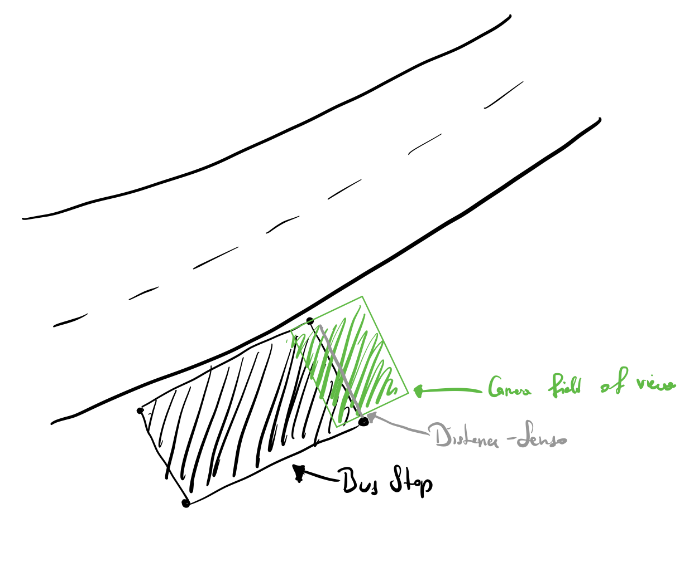
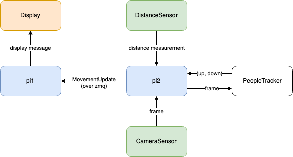

# NoCrowdTransit
Recent events have focused public attention on the topic of minimizing personal contact.

Even though a significant amount of workers are able to (at least temporarily) switch to working from home or commute to work via motorized individual transport, the number of urban inhabitants relying on public transport to commute on a daily basis should not be underestimated.

In order to make commuting via bus and trams in cities safer for all people involved, we aim to create a system for analyzing the utilization of buses and bus stops.  

## Choices of Sensors

For our implementation of the project proposal given in Milestone 1, we're working with a camera sensor in combination with a distance sensor. The implementation, however differs a little from the project proposal in the exact placement of these sensors. Furthermore, since we are not able to use real-time sensor input (e.g. camera) for our implementation we decided to use mocked sensor data instead (e.g. Loading a video into the Python sensor object instead).

The placement of the sensors has changed slightly, since we for this implementation only focus on the part of the project that recognizes how many people are at the stop at a given time. Since we wanted to implement a minimal essential working of our project, we focused on recognizing how many people enter and leave the stop (as well as displaying that information). During planning our development, we noticed that it would be beneficial to place our sensors a little differently, as is outlined in the following illustration.

Most notably, as you can see in the picture, the "line of sight" of the distance sensor now overlaps with the camera sensor's field of view such that it splits the camera FoV approximately along the halfway line. 

---

## Implementation Details

### General Information

The most important part of our implementation is the PeopleTracker class and the CameaSensor input it uses. First up, we made a slight change to the way the CameraSensor works, and added a rxPy subject, so that communication between the camera sensor, the raspberry class and the PeopleTracker class gets easier. 

On every frame the cameraSensor reads from the given video input, the on_next method on the subject and the subscriber (in this case the pi2) is notified. The pi2 on the other hand passes the frame (as well the eventual `on_completed` event) along to the PeopleTracker. The PeopleTracker will analyze the frame, and if there is a new movement (= people walking in or out of the bus stop) will publish that data on his own subject that the pi2 listens on. If the pi2 receives an `on_completed ` event, he will "tear down" the PeopleTracker, which will cause it to  release the file handle on the debug output video (if writing to the video was even enabled in the first place). All movement the pi2 receives (in the `on_people_moved` method) will be validated by checking if the distanceSensor has also registered a movement at the same time. Successfully validated movements are then sent to the pi1 via zeroMq and displayed on the display there. The general ways of communication are illustrated in the following (not quite UML-conform but hopefully understandable) diagram.

### Other Implementation Details

To make communication between pi1 and pi2 easier, we have also implemented helper functions to be able to send python objects (defined in the `messages` folder). These objects are first automatically serialised to JSON-strings using the _jsonpickle_ library, sent over zmq and decoded on the other side again. 

This functionality is defined as a part of the `AbstractRaspberryPi` to make it accessible to both pi1 and pi2. Whenever messages are received, the `on_receive_string` and `on_receive_object` functions (that can be implemented when inheriting from the `AbstractRaspberryPi`) are called automatically.

### The PeopleTracker Implementation

Our peopleTracker implementation uses a deep neural network, in order to both first detect and then track moving objects (in this case, persons). In particular, we use a *MobileNet* *Single Shot Detector*. [MobileNets](https://arxiv.org/abs/1704.04861) are a special form of neural networks that are not as accurate as regular convolutional networks, but make up the lack of accurracy by increased speed. We can combine them with a SingleShotDetector to get fast object detection.  

As our network, we're using a Caffe-trained model that is available [here on GitHub](https://github.com/chuanqi305/MobileNet-SSD). The advantage of using a pre-trained object classification network is that we can just import the model into our program without a lot of work required.

Tracking the objects works, by using a dlib CorrelationTracker, that can calculate, how the content of a rectangle moves from one frame to another. To check if this is valid, we also define a maximum threshold of 30 pixels that a person can move from one frame to another. 
The `CentroidTracker` then is used to check which rectangles belong to one series by identifying them with their ids. Furthermore, the CentroidTracker also automatically detects if new rectangles have entered the frame and deletes rectangles that haven't been in the frame for more than 30 analysis steps (=about a second).

Our analyzation of camera images happens in the `PeopleTracker.analyzeFrame` method, where in general, every third frame is analyzed for new objects to track (the rest is just skipped to speed up calculations). Analyzation works in the following steps:

(for each incoming frame)

* (on every third frame): check if new objects showed up
  * Pass the image to the neural net and get object detection results
  * (for all detections with at least 50% confidence:) 
    * check if the object is a person
    * find bounding box
    * create a `dlib` `CorrelationTracker` for the person (or their bounding box)
* (otherwise): (for all the trackers)
  * send frame to the tracker and get position
  * get the new position of each person
* calculate centroids for all persons (middle of bounding box)
* create variable up, down for counting how many people moved across the line in this frame
* (for all persons)
  * calculate movement direction = current y - last y of centroid
  * check if movement was over the midline
    * increase up or down depending on movment direction
* if up or down != 0 publish (up, down)-event to subject

---

## Testing the program

* Install all the dependencies (`pip3 install -r requirements.txt`)
* Run the `main.py` script
* Start the camera sensor in pi2: Click the `pi2 camera` tab, select video source and disable liveView, then click `Start`. If lifeView crashes your opencv, disable it before clicking `Start`.
* Whenever people move into the stop or out of the stop, a notification is shown on pi1's display.
* If you want to create your own debug video (in `out_video.mp4`), comment out line 34 in `pi2.py`.

## Example output

By setting the PeopleTracker.writeVideo property to `True`, you can make the PeopleTracker produce a video showing how it works. One such exemplary output video can be found in the `docs/out_video.mp4` file. This video nicely illustrates how people are tracked from the moment they move into the frame at the top side, until the moment they exit the frame at the bottom. 

Once a person walks over the midway line (indicated with the yellow line), the PeopleTracker recognizes a person is entering or exiting the stop - depending on the direction - and will change the up- and down- totals accordingly.